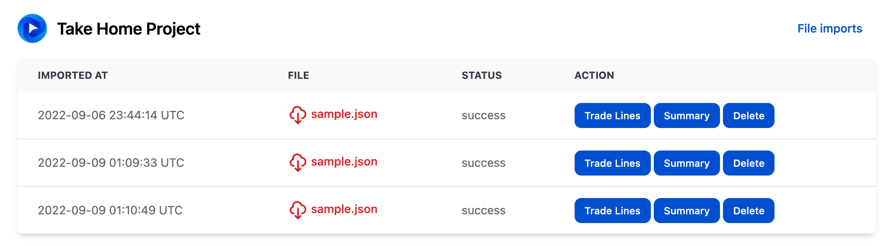
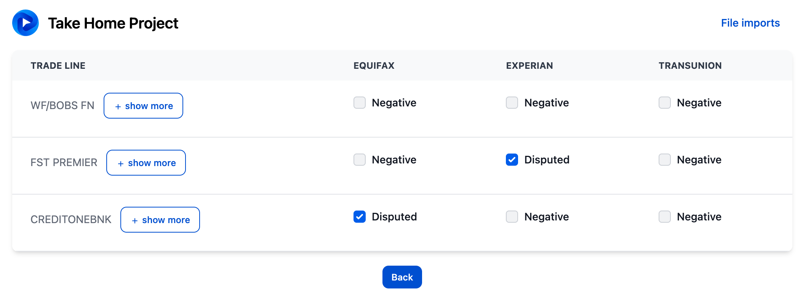
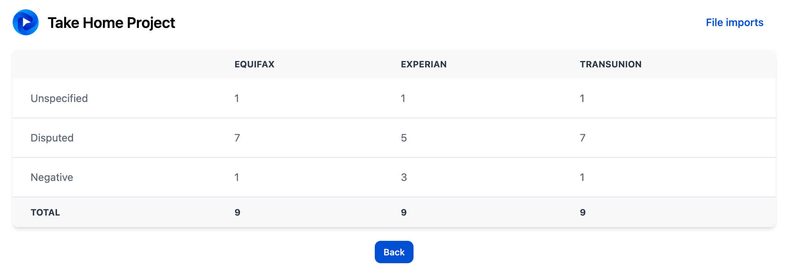
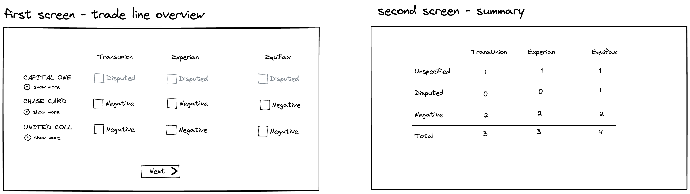

### Notes

Import JSON file with trade lines:
```ruby
# db/data/sample.json
bundle exec rake data:import\[db/data/sample.json\]
```
If you don't want to run this rake task - `rake db:seeds` also imports sample.json file into the application ;)

Kick off rails app:
```ruby
bin/setup
bin/dev
```

Run specs:
```ruby
bundle exec rspec
```
All models, service classes and serializes are 100% covered with specs. Additionally, there are requests and feature specs that cover the rest functionality and the UI.

Pages:
1. `/` - File imports. History of uploaded JSON files with data

2. `/file_imports/:id/trade_lines` - Trade lines. Processed trade lines from the specific imported file

3. `/file_imports/:id/summary` - Summary. Summary of processed trade lines from the specific imported file


# Take-home exercise

The first step at credit repair is getting the credit reports, parsing them and classifying the relevant information. A credit report contains four major data sections (personal information, trade lines, inquiries and public information) across three bureaus (Experian, Equifax, and TransUnion).

Suppose you have one credit report section already parsed and in structured JSON format - trade lines. Your job is to build a small full-stack tool that will classify trade lines according to given rules and allows for marking which ones we will be disputing.



## Classification (backend)

Let’s assume we have a simple classification algorithm that marks each trade line either as “negative” or “disputed” or provides no classification.

When any of the following rules are true for a given trade line, mark it as “negative”:
- Any payment reported in `payment_history` is not OK or empty
- Any of the attributes (comments, account type, account type detail, payment status) contains the “collection” keyword

When comments include the ‘dispute’ keyword, mark the trade line as “disputed”.

## UI (frontend)

Your job is now to present the information clearly and to allow for selecting tradelines for dispute while following these rules:
- Only negative trade lines can be disputed.
- Trade lines classified as “disputed” items and items that have no classification cannot be disputed

Once the user selects the items, they can submit the information and see a new page showing a summary of the number of disputed items for each bureau.

## Data

See the `sample.json` file in this directory.

## Stack

We recommend using Ruby on Rails 7 with Hotwire to complete this challenge.


